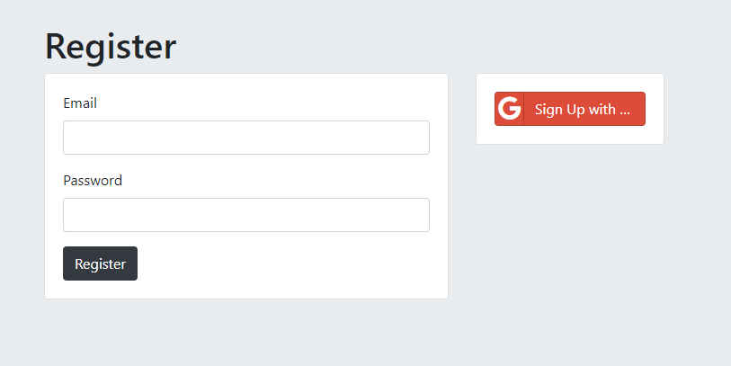

# Practice Web Dev Authentication
## Basic Authentication Practice

Practice using node and express

## Usage

Must have mongodb running for website to work.

    sudo service mongodb start
    [sudo] password for caitlyn: 
    * Starting database mongodb  

Start app.js using nodemon.

Open browser and go to `localhost:3000`

## Technologies Used

* [node.js](https://nodejs.org/en/) - A way to use JavaScript without the browser.
* [express](http://expressjs.com/) - Web Framework. I used it for get and post HTTP requests to communicate with the browser. 
* [mongodb](https://www.mongodb.com/) - A NoSQL Database that holds our users.
* [mongoose](https://mongoosejs.com/) - Connects to the mongodb and creates a Schema, which is a model template. Also used to create a new model using that Schema. 
* [passport](http://www.passportjs.org/) - Used to authenticate the users in both local and remote authentication. Examples of remote authentication endpoints are Google, Facebook, GitHub, Twitter and others.  
* [oauth2](https://developers.google.com/identity/protocols/OAuth2) - I used it to login and verify my users with Google. 
* [ejs](https://ejs.co/) - A HTML file that includes javascript using the ejs tags. ex: `<%`

## What I Learned

### Google Oauth2

In this module, I learned  how to set up Google authentication using Oauth2. I used the [Google developer console](https://console.developers.google.com/).

 
